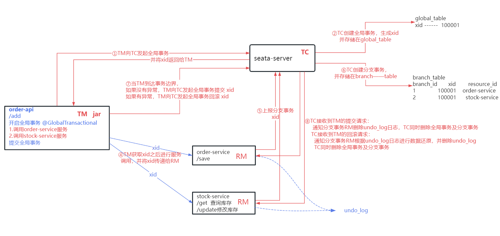
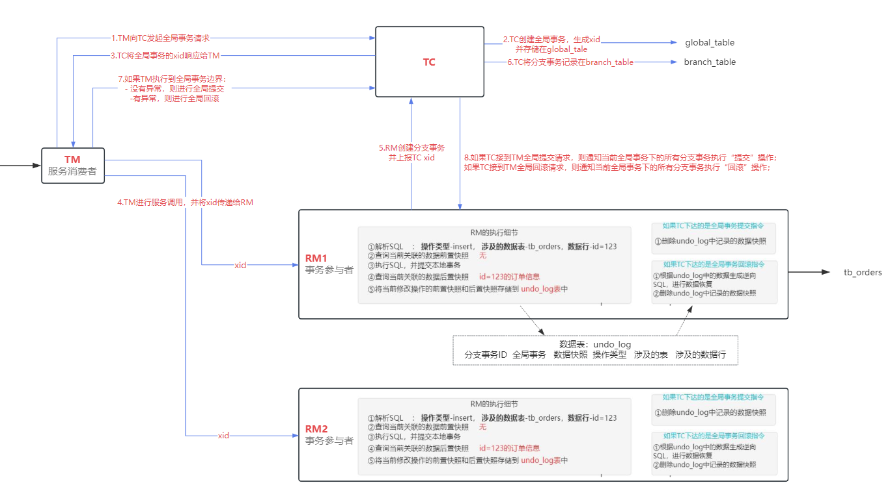
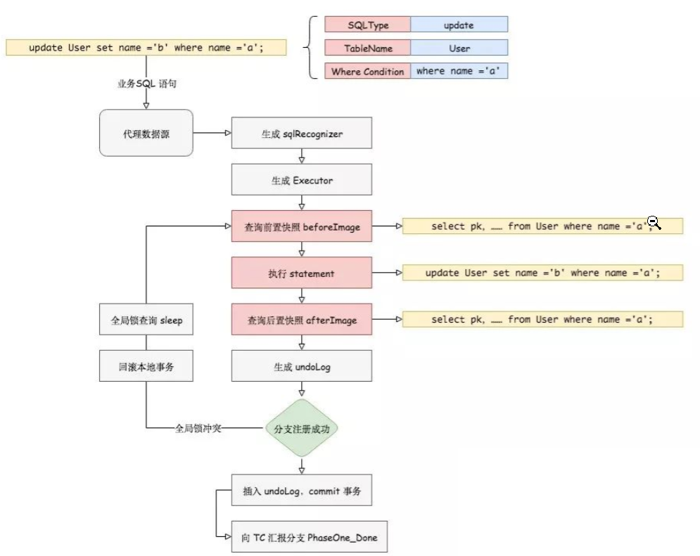
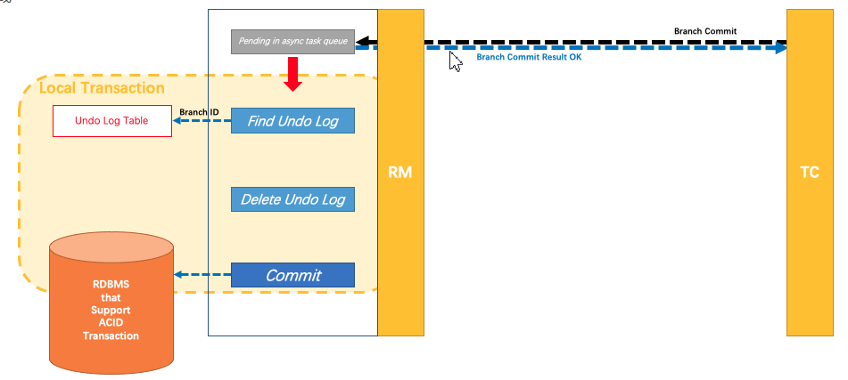
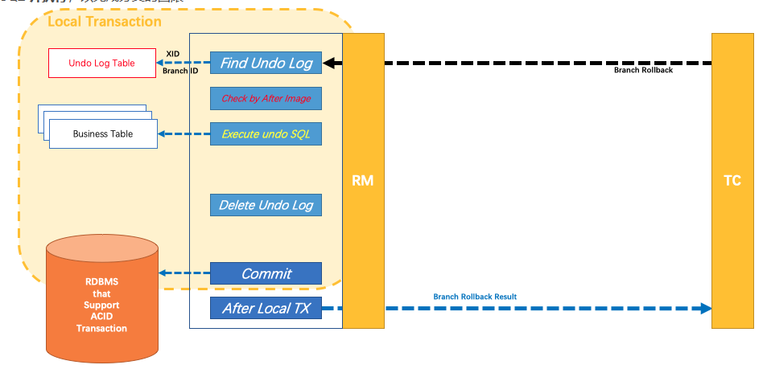
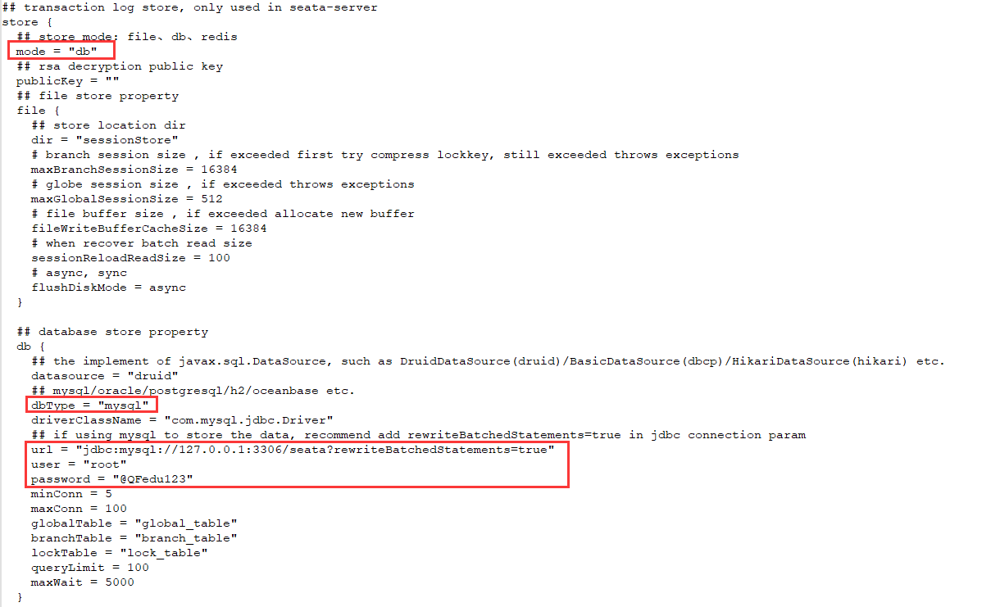
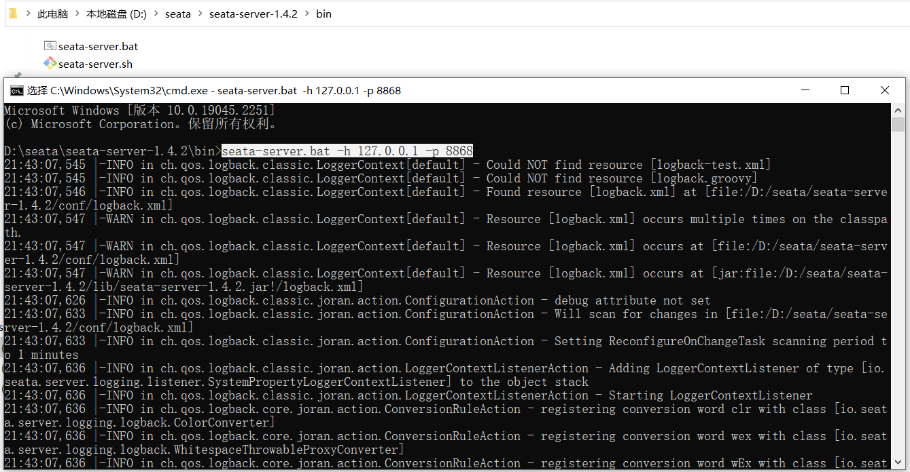

## 分布式事务

### 一、本地事务回顾

> 事务，完成一个特定业务的多个步骤（数据库写操作）的集合
>
> 借书：
>
> ​	①在记录表中添加借书记录   1
>
> ​	②在图书信息表中修改库存   9
>
> 还书：
>
> ​	①在记录表中修改记录状态 
>
> ​	②在图书信息表中还原库存
>
> 提交订单：
>
> ​	①校验库存 
>
> ​	②向订单表添加订单 
>
> ​	③向快照表保存快照 
>
> ​	④修改商品库存 
>
> ​	⑤删除购物车记录

##### 1.1 ACID特性

- 原子性(A) ：一个事务中的多个步骤(操作)，要么同时成功，要么同时失败，不存在中间状态
- 一致性(C)：
- 隔离性(I)：
- 持久性(D)

##### 1.2 事务的隔离级别

> 两个或多个事务并发操作相同的数据的时候事务之间的相互访问关系

| 隔离级别                    | 脏读 | 不可重复读 | 幻读 |
| --------------------------- | ---- | ---------- | ---- |
| read uncommitted   读未提交 | √    | √          | √    |
| read committed  读已提交    | ×    | √          | √    |
| repeatable read  可重复读   | ×    | ×          | √    |
| serializable 串行化         | ×    | ×          | ×    |

- 查询当前隔离级别：select @@tx_isolation
- 设置隔离级别：set session transaction isolation level  `隔离级别`

##### 1.3 事务的操作

- 开启事务：start transaction
- 提交事务：commit
- 事务回滚：rollaback

##### 1.4 单体应用的事务管理


- 面试题1：什么是事务
- 面试题2：事务的ACID特性
- 面试题3：事务的隔离级别
- 面试题4：解释脏读、不可重复度、幻读
- 面试题5：Spring事务管理的方式 —— 声明式事务和注解式事务
- 面试题6：Spring事务的隔离级别
- 面试题7：事务的传播机制（概念、7种）

### 二、分布式事务

> 分布式事务：就是指事务的参与者、支持事务的服务器（数据库服务器）、资源服务器以及事务的管理器分布在分布式系统的不同节点中
>
> **分布式事务**：一个事务中多个数据库操作步骤使用的不同的数据源
>
> 只要事务使用到了多个数据源对象操作数据库，就都属于分布式事务

##### 分布式事务 & 分布式锁

- 分布式事务：完成事务的多个步骤位于不同的节点上
- 分布式锁：用于解决分布式系统中事务之间的并发访问问题

### 三、分布式事务解决方案

##### 3.1 刚性事务与柔性事务

- 刚性事务：满足ACID特性的事务（强一致性）————本地事务

  ```
  开启事务
     ①保存订单  --- 执行--缓存
     ②修改库存  --- 执行--缓存
  提交事务   缓存---同步到数据库
  ```

- 柔性事务：满足BASE理论的事务（最终一致性）————分布式事务

  - 在订单保存成功之后，修改库存成功之前数据式不一致的，但是在整个分布式的所有步骤完成之后，数据最终的一致的

  

- 如何保证分布式事务的最终一致性？
  - XA-2PC
  - 补偿
  - 异步确保
  - 最大努力通知

##### 3.2 分布式事务解决方案

- XA 模型
- **AT 模型**
- TCC 模型

##### 3.3 分布式事务框架

- zookeeper
- Tx-LCN  （支持XA模式、支持TCC模式）
- Spring Cloud alibaba seata （支持XA 、**AT**、TCC、SAGA）

### 四、Seata简介

> Seata(Simple Extensible Autonomous Transaction Architecture) 是 阿里巴巴开源的分布式事务中间件，以高效并且对业务 0 侵入的方式，解决微服务场景下面临的分布式事务问题。
>
> Seata 是一款开源的分布式事务解决方案，致力于提供高性能和简单易用的分布式事务服务。Seata 将为用户提供了 AT、TCC、SAGA 和 XA 事务模式，为用户打造一站式的分布式解决方案。

github地址：https://github.com/seata/seata

中文官网：http://seata.io/zh-cn/

#### 4.1 AT模式角色分析

**Transaction Coordinator (TC)**： 事务协调器，维护全局事务的运行状态，负责协调并驱动全局事务的提交或回滚

**Transaction Manager ™**： 控制全局事务的边界，负责开启一个全局事务，并最终发起全局提交或全局回滚的决议

**Resource Manager (RM)**： 控制分支事务，负责分支注册、状态汇报，并接收事务协调器的指令，驱动分支（本地）事务的提交和回滚

| Seata AT模式的实现原理                                       |
| ------------------------------------------------------------ |
|  |

#### 4.2 AT模式工作流程

> RM是如何实现数据提交和回滚的？ 



**第一阶段**（RM的实现细节）




**二阶段提交**

如果决议是全局提交，此时分支事务此时已经完成提交，不需要同步协调处理（只需要异步清理回滚日志），Phase2 可以非常快速地完成



**二阶段回滚**

如果决议是全局回滚，RM 收到协调器发来的回滚请求，通过 XID 和 Branch ID 找到相应的回滚日志记录，**通过回滚记录生成反向的更新 SQL 并执行**，以完成分支的回滚




### 五、Seata应用

#### 5.0 项目功能开发

> 构建分布式事务场景
>
> 微服务的SpringBoot版本基于 2.3.12.RELEASE

###### 1.创建order-service服务

> 添加订单

- 创建订单信息表 tb_orders

  ```sql
  create table tb_orders(
  	order_id varchar(32) primary key,
  	user_id varchar(32) not null,
  	product_id varchar(32) not null,
  	product_num int not null,
  	order_total_price int not null,
  	order_remark varchar(100)
  );
  ```

- 创建订单实体类

  ```java
  @Data
  @NoArgsConstructor
  @AllArgsConstructor
  @TableName("tb_orders")
  public class Order {
  
      @TableId
      private String orderId;
      private String userId;
      private String productId;
      private Integer productNum;
      private Integer orderTotalPrice;
      private String orderRemark;
  
  }
  ```

- 创建OrderMapper

  ```java
  public interface OrderMapper extends BaseMapper<Order> {
  }
  ```

- 创建OrderService保存订单

  ```java
  public interface OrderService {
  
      public Order saveOrder(Order order);
  
  }
  ```

  ```java
  @Service
  public class OrderServiceImpl implements OrderService {
  
      @Autowired
      private OrderMapper orderMapper;
  
      @Override
      public Order saveOrder(Order order) {
          //1.生成订单ID
          String orderId = System.currentTimeMillis()+"";
          System.out.println("-----------生成订单编号："+orderId);
          //2.保存订单
          order.setOrderId(orderId);
          System.out.println("-----------保存订单信息");
          int i = orderMapper.insert(order);
          return order;
      }
  }
  ```

- 创建OrderController提供保存订单的服务

  ```java
  @RestController
  @RequestMapping("/order")
  public class OrderController {
  
      @Autowired
      private OrderService orderService;
  
      @PostMapping("/save")
      public Order save(@RequestBody Order order){
          return orderService.saveOrder(order);
      }
  
  }
  ```

###### 2.创建stock-service服务

> 修改库存

- 创建商品信息表 tb_products

  ```sql
  CREATE TABLE `tb_products`  (
    `product_id` int(0) NOT NULL AUTO_INCREMENT,
    `product_name` varchar(50) CHARACTER SET utf8 COLLATE utf8_general_ci NOT NULL,
    `product_desc` varchar(200) CHARACTER SET utf8 COLLATE utf8_general_ci NOT NULL,
    `product_stock` int(0) NULL DEFAULT NULL,
    PRIMARY KEY (`product_id`) USING BTREE
  ) ENGINE = InnoDB AUTO_INCREMENT = 12 CHARACTER SET = utf8 COLLATE = utf8_general_ci ROW_FORMAT = Dynamic;
  
  -- ----------------------------
  -- Records of tb_products
  -- ----------------------------
  INSERT INTO `tb_products` VALUES (1, '小米10', '小米10描述信息', 8);
  INSERT INTO `tb_products` VALUES (2, '华为P50', '华为P50描述信息', 81);
  INSERT INTO `tb_products` VALUES (3, '康佳电视', '康佳电视描述信息', 11);
  INSERT INTO `tb_products` VALUES (4, '铁三角麦克风', '铁三角麦克风描述信息', 9);
  INSERT INTO `tb_products` VALUES (5, '海尔冰箱', '海尔冰箱描述信息', 12);
  INSERT INTO `tb_products` VALUES (6, '美的空调', '美的空调描述信息', 6);
  INSERT INTO `tb_products` VALUES (7, '联想笔记本', '联想笔记本描述信息', 6);
  INSERT INTO `tb_products` VALUES (8, '哇哈哈', '哇哈哈描述信息', 6);
  INSERT INTO `tb_products` VALUES (9, 'test', 'testdesc', 6);
  INSERT INTO `tb_products` VALUES (10, '康师傅', '康师傅方便面', 6);
  INSERT INTO `tb_products` VALUES (11, '小浣熊', '童年的记忆', 99);
  INSERT INTO `tb_products` VALUES (12, '大大泡泡糖', '这是一个神奇的东西', 87);
  ```

- 创建Product类

  ```java
  @Data
  @NoArgsConstructor
  @AllArgsConstructor
  @TableName("tb_products")
  public class Product {
  
      @TableId
      private String productId;
      private String productName;
      private String productDesc;
      private Integer productStock;
  
  }
  ```

- 创建ProductMapper

  ```java
  public interface ProductMapper extends BaseMapper<Product> {
  }
  ```

- 创建Service实现修改库存的业务

  ```java
  public interface StockService {
  
      public Boolean updateStock(String productId,Integer num);
  
  }
  ```

  ```java
  @Service
  public class StockServiceImpl implements StockService {
  
      @Autowired
      private ProductMapper productMapper;
  
      @Override
      public Boolean updateStock(String productId, Integer num) {
          //1.查询原始库存
          Product product = productMapper.selectById(productId);
          product.setProductStock( product.getProductStock()-num );
          System.out.println("----修改库存："+productId+"~~~"+num);
          //2.修改库存
          int i = productMapper.updateById(product);
          return true;
      }
  }
  ```

- 创建Controller，对外提供修改库存的服务

  ```java
  @RestController
  @RequestMapping("/stock")
  public class StockController {
  
      @Autowired
      private StockService stockService;
  
      @PostMapping("/update")
      public Boolean update(String productId,Integer num){
          return stockService.updateStock(productId,num);
      }
  
  }
  ```

###### 3.创建order-api服务

- 创建订单实体类

  ```java
  @Data
  @NoArgsConstructor
  @AllArgsConstructor
  public class Order {
  
      private String orderId;
      private String userId;
      private String productId;
      private Integer productNum;
      private Integer orderTotalPrice;
      private String orderRemark;
      //。。。。
  
  }
  ```

- 创建订单添加接口

  ```java
  @RestController
  @CrossOrigin
  @RequestMapping("/order")
  public class OrderApiController {
  
      @Autowired
      private OrderService orderService;
  
      @PostMapping("/add")
      public ResultVO add(@RequestBody  Order order){
          return orderService.addOrder(order);
      }
      
  }
  ```

- 创建订单业务处理类

  ```java
  public interface OrderService {
  
      public ResultVO addOrder(Order order);
  
  }
  ```

  ```java
  @Service
  public class OrderServiceImpl implements OrderService {
  
      @Autowired
      private OrderServiceFeignClient orderServiceFeignClient;
      @Autowired
      private StockServiceFeignClient stockServiceFeignClient;
      
      public ResultVO addOrder(Order order) {
          System.out.println("~~~~~~~~订单业务：");
          //1.调用订单服务 order-service 保存订单
          Order order1 = orderServiceFeignClient.save(order);
          System.out.println(order1);
          //2.调用库存服务 stock-service 修改库存
          Boolean b = 
              stockServiceFeignClient.update(order1.getProductId(), order.getProductNum());
          System.out.println(b);
          return new ResultVO(0,"success",order1);
      }
  }
  ```

- 创建调用服务的feign客户端

  ```java
  @FeignClient("order-service")
  public interface OrderServiceFeignClient {
  
      @PostMapping("/order/save")
      public Order save(Order order);
  }
  ```

  ```java
  @FeignClient("stock-service")
  public interface StockServiceFeignClient {
  
      @PostMapping("/stock/update")
      public Boolean update(@RequestParam("productId") String productId,
                            @RequestParam("num") Integer num);
  
  }
  ```

  

#### 5.1 下载并配置 seata-server

官方：[Seata](http://seata.io/zh-cn/index.html)

下载地址：[Tags · seata/seata · GitHub](https://github.com/seata/seata/tags)

解压: 将seata-server.zip解压的指定的目录

##### 5.1.1 建库建表

###### 1. 创建seata数据库

> create database seata

###### 2.创建seata所需的3张表


表的脚本下载地址：https://github.com/seata/seata/tree/develop/script/server/db

```sql
----- The script used when storeMode is 'db'----
-- the table to store GlobalSession data
CREATE TABLE IF NOT EXISTS `global_table`
(
    `xid`                       VARCHAR(128) NOT NULL,
    `transaction_id`            BIGINT,
    `status`                    TINYINT      NOT NULL,
    `application_id`            VARCHAR(32),
    `transaction_service_group` VARCHAR(32),
    `transaction_name`          VARCHAR(128),
    `timeout`                   INT,
    `begin_time`                BIGINT,
    `application_data`          VARCHAR(2000),
    `gmt_create`                DATETIME,
    `gmt_modified`              DATETIME,
    PRIMARY KEY (`xid`),
    KEY `idx_gmt_modified_status` (`gmt_modified`, `status`),
    KEY `idx_transaction_id` (`transaction_id`)
) ENGINE = InnoDB
  DEFAULT CHARSET = utf8;

-- the table to store BranchSession data
CREATE TABLE IF NOT EXISTS `branch_table`
(
    `branch_id`         BIGINT       NOT NULL,
    `xid`               VARCHAR(128) NOT NULL,
    `transaction_id`    BIGINT,
    `resource_group_id` VARCHAR(32),
    `resource_id`       VARCHAR(256),
    `branch_type`       VARCHAR(8),
    `status`            TINYINT,
    `client_id`         VARCHAR(64),
    `application_data`  VARCHAR(2000),
    `gmt_create`        DATETIME(6),
    `gmt_modified`      DATETIME(6),
    PRIMARY KEY (`branch_id`),
    KEY `idx_xid` (`xid`)
) ENGINE = InnoDB
  DEFAULT CHARSET = utf8;

-- the table to store lock data
CREATE TABLE IF NOT EXISTS `lock_table`
(
    `row_key`        VARCHAR(128) NOT NULL,
    `xid`            VARCHAR(96),
    `transaction_id` BIGINT,
    `branch_id`      BIGINT       NOT NULL,
    `resource_id`    VARCHAR(256),
    `table_name`     VARCHAR(32),
    `pk`             VARCHAR(36),
    `gmt_create`     DATETIME,
    `gmt_modified`   DATETIME,
    PRIMARY KEY (`row_key`),
    KEY `idx_branch_id` (`branch_id`)
) ENGINE = InnoDB
  DEFAULT CHARSET = utf8;
```

##### 5.1.2 配置seata-server数据源

| `conf/file.conf`                                             |
| ------------------------------------------------------------ |
|  |

##### 5.1.3 修改seata-server的注册中心

| conf\registry.conf                                           |
| ------------------------------------------------------------ |
|  |

##### 5.1.4 修改seata-server的配置中心

| conf\registry.conf                                           |
| ------------------------------------------------------------ |
|  |

##### 5.1.5 Nacos配置中心管理seata配置

> 在nacos的public命名空间创建名为 `seataServer.properties`

###### 1.创建配置文件


###### 2.下载配置项，粘贴到新创建的配置文件

https://github.com/seata/seata/tree/develop/script/config-center

```properties
transport.type=TCP
transport.server=NIO
transport.heartbeat=true
transport.enableClientBatchSendRequest=false
transport.threadFactory.bossThreadPrefix=NettyBoss
transport.threadFactory.workerThreadPrefix=NettyServerNIOWorker
transport.threadFactory.serverExecutorThreadPrefix=NettyServerBizHandler
transport.threadFactory.shareBossWorker=false
transport.threadFactory.clientSelectorThreadPrefix=NettyClientSelector
transport.threadFactory.clientSelectorThreadSize=1
transport.threadFactory.clientWorkerThreadPrefix=NettyClientWorkerThread
transport.threadFactory.bossThreadSize=1
transport.threadFactory.workerThreadSize=default
transport.shutdown.wait=3

service.vgroupMapping.xx=default
service.default.grouplist=127.0.0.1:8091
service.enableDegrade=false
service.disableGlobalTransaction=false

client.rm.asyncCommitBufferLimit=10000
client.rm.lock.retryInterval=10
client.rm.lock.retryTimes=30
client.rm.lock.retryPolicyBranchRollbackOnConflict=true
client.rm.reportRetryCount=5
client.rm.tableMetaCheckEnable=false
client.rm.tableMetaCheckerInterval=60000
client.rm.sqlParserType=druid
client.rm.reportSuccessEnable=false
client.rm.sagaBranchRegisterEnable=false
client.tm.commitRetryCount=5
client.tm.rollbackRetryCount=5
client.tm.defaultGlobalTransactionTimeout=60000
client.tm.degradeCheck=false
client.tm.degradeCheckAllowTimes=10
client.tm.degradeCheckPeriod=2000

store.mode=db

store.publicKey=
store.file.dir=file_store/data
store.file.maxBranchSessionSize=16384
store.file.maxGlobalSessionSize=512
store.file.fileWriteBufferCacheSize=16384
store.file.flushDiskMode=async
store.file.sessionReloadReadSize=100

store.db.datasource=druid
store.db.dbType=mysql
store.db.driverClassName=com.mysql.jdbc.Driver
store.db.url=jdbc:mysql://127.0.0.1:3306/seata?useUnicode=true
store.db.user=root
store.db.password=@QFedu123

store.db.minConn=5
store.db.maxConn=30
store.db.globalTable=global_table
store.db.branchTable=branch_table
store.db.queryLimit=100
store.db.lockTable=lock_table
store.db.maxWait=5000
store.redis.mode=single
store.redis.single.host=127.0.0.1
store.redis.single.port=6379
store.redis.maxConn=10
store.redis.minConn=1
store.redis.maxTotal=100
store.redis.database=0
store.redis.password=
store.redis.queryLimit=100
server.recovery.committingRetryPeriod=1000
server.recovery.asynCommittingRetryPeriod=1000
server.recovery.rollbackingRetryPeriod=1000
server.recovery.timeoutRetryPeriod=1000
server.maxCommitRetryTimeout=-1
server.maxRollbackRetryTimeout=-1
server.rollbackRetryTimeoutUnlockEnable=false
client.undo.dataValidation=true
client.undo.logSerialization=jackson
client.undo.onlyCareUpdateColumns=true
server.undo.logSaveDays=7
server.undo.logDeletePeriod=86400000
client.undo.logTable=undo_log
client.undo.compress.enable=true
client.undo.compress.type=zip
client.undo.compress.threshold=64k
log.exceptionRate=100
transport.serialization=seata
transport.compressor=none
metrics.enabled=false
metrics.registryType=compact
metrics.exporterList=prometheus
metrics.exporterPrometheusPort=9898
```

###### 3. 修改相关配置项

```properties
service.vgroupMapping.xx=default

store.db.datasource=druid
store.db.dbType=mysql
store.db.driverClassName=com.mysql.cj.jdbc.Driver
store.db.url=jdbc:mysql://127.0.0.1:3306/seata?useUnicode=true&characterEncoding=utf8&serverTimezone=GMT
store.db.user=root
store.db.password=@QFedu123
```


###### 4.发布配置文件


`注意：目前只支持properties，不支持yml`

##### 5.1.6 启动seata-server

```shell
seata-server.bat -h 127.0.0.1 -p 8868
```



**注意：保证所有服务的监听ip都是局域网能够访问的ip地址**


#### 5.3 Seata客户端配置

> 一个调用链中的所有微服务都是seata的客户端，都需要进行客户端配置

##### 5.3.1 创建undo_log表

在RM连接的数据库中创建undo_log

下载地址：https://github.com/seata/seata/tree/develop/script/client/at/db

```sql
-- for AT mode you must to init this sql for you business database. the seata server not need it.
CREATE TABLE IF NOT EXISTS `undo_log`(
    `branch_id`     BIGINT(20)   NOT NULL COMMENT 'branch transaction id',
    `xid`           VARCHAR(100) NOT NULL COMMENT 'global transaction id',
    `context`       VARCHAR(128) NOT NULL COMMENT 'undo_log context,such as serialization',
    `rollback_info` LONGBLOB     NOT NULL COMMENT 'rollback info',
    `log_status`    INT(11)      NOT NULL COMMENT '0:normal status,1:defense status',
    `log_created`   DATETIME(6)  NOT NULL COMMENT 'create datetime',
    `log_modified`  DATETIME(6)  NOT NULL COMMENT 'modify datetime',
    UNIQUE KEY `ux_undo_log` (`xid`, `branch_id`)
) ENGINE = InnoDB AUTO_INCREMENT = 1 DEFAULT CHARSET = utf8 COMMENT ='AT transaction mode undo table';
```

##### 5.3.2 pom依赖

> 以下seata客户端配置是基于SpringBoot版本：
>
> ```
> <spring-boot.version>2.3.12.RELEASE</spring-boot.version>
> <spring-cloud-alibaba.version>2.2.10-RC1</spring-cloud-alibaba.version>
> ```

```xml
<dependency>
    <groupId>com.alibaba.cloud</groupId>
    <artifactId>spring-cloud-alibaba-seata</artifactId>
    <version>2.2.0.RELEASE</version>
    <exclusions>
        <exclusion>
            <groupId>io.seata</groupId>
            <artifactId>seata-spring-boot-starter</artifactId>
        </exclusion>
    </exclusions>
</dependency>
<dependency>
    <groupId>io.seata</groupId>
    <artifactId>seata-spring-boot-starter</artifactId>
    <version>1.4.2</version>
</dependency>
```

##### 5.3.3 配置

```yml
seata:
  enabled: true
  tx-service-group: xx  # 要和seata-server配置文件中的service.vgroupMapping.xx=default保持一致
  enable-auto-data-source-proxy: true
  config:
    type: nacos
    nacos:
      server-addr: localhost:8848
      group: DEFAULT_GROUP
      username: nacos
      password: nacos
      data-id: seataServer.properties
  registry: #发现seata-server
    type: nacos
    nacos:
      application: seata-server
      server-addr: 127.0.0.1:8848
      group: DEFAULT_GROUP
      username: nacos
      password: nacos
```

##### 5.3.4 @Globaltransational

在订单接口的业务方法上添加` @Globaltransational`注解

```java
@Service
public class OrderServiceImpl implements OrderService {

    @Autowired
    private OrderMapper orderMapper;

    @GlobalTransactional
    public Order saveOrder(Order order) {
        //1.生成订单ID
        String orderId = System.currentTimeMillis()+"";
        System.out.println("-----------生成订单编号："+orderId);
        //2.保存订单
        order.setOrderId(orderId);
        System.out.println("-----------保存订单信息");
        int i = orderMapper.insert(order);
        return order;
    }
}
```


### 六、Seata全局事务并发隔离

> 全局事务并行修改同一数据怎么隔离?——全局锁

#### 写隔离

> - 一阶段本地事务提交前，需要确保先拿到 **全局锁** 。
> - 拿不到 **全局锁** ，不能提交本地事务。
> - 拿 **全局锁** 的尝试被限制在一定范围内，超出范围将放弃，并回滚本地事务，释放本地锁。

以一个示例来说明：

两个全局事务 tx1 和 tx2，分别对 a 表的 m 字段进行更新操作，m 的初始值 1000。

tx1 先开始，开启本地事务，拿到本地锁，更新操作 m = 1000 - 100 = 900。本地事务提交前，先拿到该记录的 **全局锁** ，本地提交释放本地锁。 

tx2 后开始，开启本地事务，拿到本地锁，更新操作 m = 900 - 100 = 800。本地事务提交前，尝试拿该记录的 **全局锁** ，tx1 全局提交前，该记录的全局锁被 tx1 持有，tx2 需要重试等待 **全局锁** 。


tx1 二阶段`全局提交`，释放 **全局锁** 。tx2 拿到 **全局锁** 提交本地事务。


如果 tx1 的二阶段`全局回滚`，则 tx1 需要重新获取该数据的本地锁，进行反向补偿的更新操作，实现分支的回滚。

此时，如果 tx2 仍在等待该数据的 **全局锁**，同时持有本地锁，则 tx1 的分支回滚会失败。分支的回滚会一直重试，直到 tx2 的 **全局锁** 等锁超时，放弃 **全局锁** 并回滚本地事务释放本地锁，tx1 的分支回滚最终成功。

因为整个过程 **全局锁** 在 tx1 结束前一直是被 tx1 持有的，所以不会发生 **脏写** 的问题。

#### 读隔离

> 在数据库本地事务隔离级别 **读已提交（Read Committed）** 或以上的基础上，Seata（AT 模式）的默认全局隔离级别是 **读未提交（Read Uncommitted）** ; 如果应用在特定场景下，必需要求全局的 **读已提交** ，目前 Seata 的方式是通过 SELECT FOR UPDATE 语句的代理。


SELECT FOR UPDATE 语句的执行会申请 **全局锁** ，如果 **全局锁** 被其他事务持有，则释放本地锁（回滚 SELECT FOR UPDATE 语句的本地执行）并重试。这个过程中，查询是被 block 住的，直到 **全局锁** 拿到，即读取的相关数据是 **已提交** 的，才返回。

出于总体性能上的考虑，Seata 目前的方案并没有对所有 SELECT 语句都进行代理，仅针对 FOR UPDATE 的 SELECT 语句。


